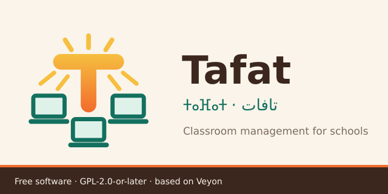

 

# Tafat — ⵜⴰⴼⴰⵜ — تافات

Free, open source classroom management for school computer labs: see and control
every screen, block apps and websites, run quizzes, take attendance, chat with
students. In Arabic, Tamazight, French and English, on Windows 7 to 11. An open
alternative to NetSupport School, made first for Algerian high schools.

> **Status:** early development, **not yet tested in a real lab**. The Windows
> installers build, but the hardware test round on real Windows 7, 8.1, 10 and 11
> PCs is still to be done (see [docs/HARDWARE-TESTS.md](docs/HARDWARE-TESTS.md)).
> Translations are drafts waiting for native review. See the
> [roadmap](docs/ROADMAP.md).

## Features

**Watch and guide**

  * Overview: monitor all computers of one or several classrooms at once
  * Remote access: view or control a computer to watch and support a student
  * Demo: broadcast the teacher's screen in realtime (fullscreen or window)
  * Messages: send a text message to students
  * Screenshots: record learning progress and document infringements
  * Running apps: see the open applications of each computer, the ones used
    before, and close them

**Keep focus**

  * Screen lock: draw attention to what matters right now
  * Block apps: block listed programs or allow only the programs of the lesson,
    optionally also USB sticks and printing
  * Block websites: block listed sites or allow only some, in Chrome, Edge,
    Brave, Chromium and Firefox, optionally block the internet for all programs

**Assess**

  * Quiz: quizzes and polls with live results, scores and CSV export
  * Rewards: give students stars for good work; each student sees a small "Well
    done!" message, and the teacher sees and exports the stars of the class

**Manage the class**

  * Register: attendance with student names on the computers (also with a
    shared account), class list import and absent students
  * Hands and chat: students raise their hands, chat with the teacher and hand in
    their work
  * Teaching material: distribute and collect documents, images and videos;
    return to each student their own corrected files
  * Start and end lessons: log in and log out users all at once
  * Power: switch computers on, off or reboot remotely
  * Programs and websites: launch programs and open website URLs remotely

**Set up the lab**

  * Install on the teacher computer only: create a student installer on a USB
    stick from Tafat Master (double-click on each student computer, no commands),
    then **Add computers** searches the network for them
  * Inventory: Windows version, processor, memory, disk, addresses and installed
    version of every computer, with CSV export

More is planned, see the [roadmap](docs/ROADMAP.md). Installing in a lab:
[docs/DEPLOYMENT.md](docs/DEPLOYMENT.md), or the French/English/Arabic page
[docs/install.html](docs/install.html). Teacher guide:
[français](docs/guide-enseignant.md), [العربية](docs/guide-enseignant-ar.md), [taqbaylit](docs/guide-aselmad-kab.md) (draft).

## Languages

Arabic, French, Tamazight (Latin and Tifinagh scripts) and English are the
target languages for the user interface.

Tamazight in Tifinagh script uses the bundled Noto Sans Tifinagh font
(SIL Open Font License 1.1, see `core/resources/fonts/NotoSansTifinagh-OFL.txt`).

## Platforms

  * Windows 10/11, 32-bit and 64-bit
  * Windows 7/8.1, 32-bit and 64-bit (legacy build, in progress)
  * Linux

## Built on Veyon

Tafat is built on [Veyon](https://veyon.io) (version 4.11.3), the free classroom
management software by Tobias Junghans / Veyon Solutions, which has been used in
schools for years. Veyon provides the foundation: computer overview, remote
access, demo, screen lock, file transfer and the network and security layer.
Tafat adds its own features as plugins and keeps Veyon's full history, so
upstream fixes can be merged (see [UPSTREAM.md](UPSTREAM.md)).

Tafat is an independent project. It is not made, endorsed or supported by Veyon
or Veyon Solutions.

Developed by [BenzidaneMo](https://github.com/BenzidaneMo) and Tafat contributors.

## Building

See [INSTALL](INSTALL) for build instructions.

## License

Copyright (C) 2026 BenzidaneMo and Tafat contributors.
Copyright (C) 2004-2026 Tobias Junghans / Veyon Solutions.

This program is free software; you can redistribute it and/or modify it under
the terms of the GNU General Public License as published by the Free Software
Foundation; either version 2 of the License, or (at your option) any later
version.

This program is distributed in the hope that it will be useful, but WITHOUT ANY
WARRANTY; without even the implied warranty of MERCHANTABILITY or FITNESS FOR A
PARTICULAR PURPOSE. See [LICENSE](LICENSE) for the license text and
[COPYING](COPYING) for the license as distributed with Veyon, including the
OpenSSL linking exception granted for Veyon's code.

SPDX-License-Identifier: GPL-2.0-or-later
